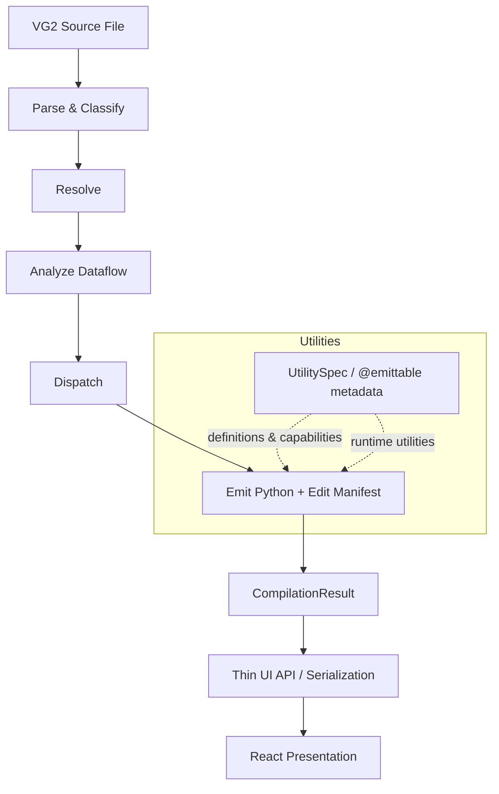

# vg2c

`vg2c` compiles legacy VG2 `.txt` pipeline scripts into executable Python (`.py`) scripts.

---

## Architecture Overview



`CompilationResult` and the compiler-stage objects are the authoritative semantic chain. The emitter records utility invocations, editable parameters, stable identities, artifact roles, capabilities, and exact generated-source spans while it generates Python. The UI API serializes those compiler-owned results and handles persistence/workspace security; React renders the returned metadata and sends edit intent back to core APIs rather than reconstructing SQL or dataflow semantics locally.

## Requirements

* Python 3.11, 3.12, or 3.13
* Git
* [`uv`](https://docs.astral.sh/uv/)
* Access to the Intel internal Git network

## Installation

Clone the repository and open PowerShell in the project directory.

Allow Git to access the required Intel internal repositories directly:

```powershell
$env:no_proxy = "mfg-github.mfg.intel.com,tmg-repo.mfg.intel.com"
```

Install `vg2c` and its dependencies into the project virtual environment:

```powershell
py -m uv sync
```

Verify the installation:

```powershell
uv run vg2c --help
```

## Oracle client setup (DataSyncX)

Only the approved full Oracle Client is supported. Set `ORACLE_HOME` to the
client root, not its `bin` directory:

```powershell
$env:ORACLE_HOME = 'C:\Oracle\Product\11.2.0\client_k64'
```

The generated workflow validates `ORACLE_HOME\network\admin` before importing
DataSyncX. That directory must contain `tnsnames.ora` and `sqlnet.ora`. If
either file is absent, copy SQLPathFinder's provided Oracle Net files from
`C:\Oracle\network` into `ORACLE_HOME\network\admin`, then start a new Python
process. No client discovery or fallback configuration is supported.

## CLI Usage

Run the interactive CLI from the project root:

```powershell
uv run vg2c .
```

Specify separate input and output directories:

```powershell
uv run vg2c path\to\inputs path\to\outputs
```

Build a standalone executable with PyInstaller:

```powershell
uv run vg2c --build
```

When the virtual environment is already activated, `uv run` may be omitted:

```powershell
vg2c .
vg2c path\to\inputs path\to\outputs
vg2c --build
```

## Visual editor

Install the optional local-app dependencies and frontend packages:

```powershell
python -m pip install -e ".[ui]"
Set-Location src/vg2c_ui/frontend
npm install
```

For development, run the API and Vite in separate terminals from the repository root:

```powershell
vg2c-ui .
npm --prefix src/vg2c_ui/frontend run dev
```

For a single local server, build the frontend once, then start `vg2c-ui`:

```powershell
npm --prefix src/vg2c_ui/frontend run build
vg2c-ui .
```

The Vite build writes the packaged frontend to `src/vg2c_ui/static`. The server only accepts source/output paths within the workspace passed to `vg2c-ui`.

Utility names, methods, parameters, annotations, defaults, `Literal` choices, return types, documentation, artifact roles, and editor capabilities come from the actual compiler utility definitions. Ordinary utilities therefore use the generic React parameter editor without utility-specific frontend code. Specialized editors are selected by explicit capabilities such as `structured-sql`.

Edits use a preview/apply flow backed by `vg2c.editing`, with compiler-owned value validation, generated-source spans, syntax validation, revision/hash conflict checks, and atomic persistence. Structured SQL parsing/transformation lives in `vg2c.sql_editor`. Draft and cross-document producer/consumer relationships are projected through `vg2c.dataflow`, including unsaved changes in inactive tabs.

The frontend contracts are generated from the Python transport models. Run:

```powershell
npm --prefix src/vg2c_ui/frontend run generate:contracts
npm --prefix src/vg2c_ui/frontend run test
```

The current API surface uses focused routes for document open/translation, change preview/apply, workspace projection, CSV preview, and structured SQL inspect/actions. There is no generic arbitrary-Python replacement or legacy `/api/commands` compatibility route.

Use **Translate** to regenerate Python from VG2. Use **Open** to reopen an existing generated workflow and retain previously applied visual-editor values when its sidecar still matches the source/output hashes.
