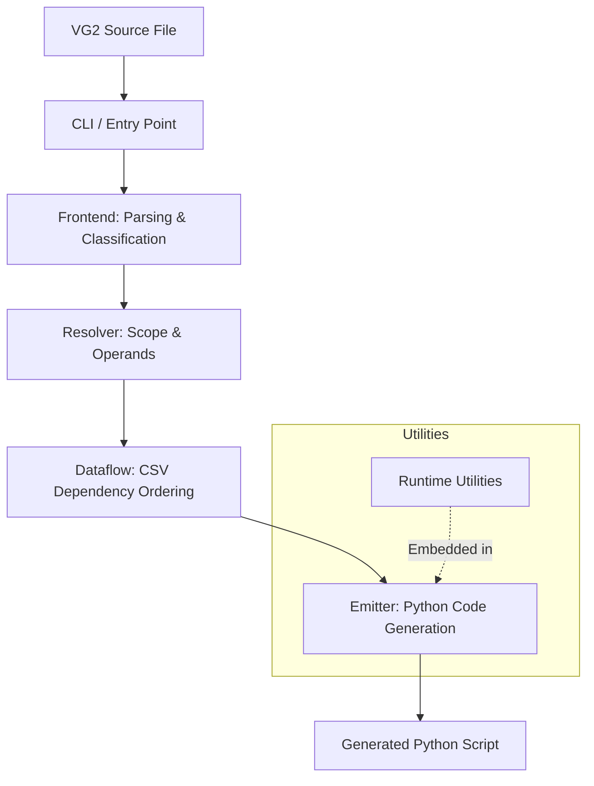

# vg2c

`vg2c` compiles legacy VG2 `.txt` pipeline scripts into executable Python (`.py`) scripts.

---

## Architecture Overview



### 1. CLI / Entry Point
- **Location**: [src/vg2c/cli.py](file:///c:/Project/SQLPathFinder_PY_Migration/src/vg2c/cli.py) (CLI) & [src/vg2c/__init__.py](file:///c:/Project/SQLPathFinder_PY_Migration/src/vg2c/__init__.py) (Core API)
- **Role**: Entry point. Finds input `.txt` files, prompts user, runs `translate()`. Builds PyInstaller binary.

### 2. Frontend Parsing & Classification
- **Location**: [src/vg2c/frontend/](file:///c:/Project/SQLPathFinder_PY_Migration/src/vg2c/frontend/)
- **Role**: Reads source code.
  - [parser.py](file:///c:/Project/SQLPathFinder_PY_Migration/src/vg2c/frontend/parser.py) splits text into blocks using header markers.
  - [classifier.py](file:///c:/Project/SQLPathFinder_PY_Migration/src/vg2c/frontend/classifier.py) maps blocks to `Kind` (e.g., SQL query, SQLite query, control flow).
- **Ownership Boundary**: Identifies file layout and classifies block kinds. Does not inspect semantics.

### 3. Scope Building
- **Location**: [src/vg2c/resolver/scope_builder.py](file:///c:/Project/SQLPathFinder_PY_Migration/src/vg2c/resolver/scope_builder.py)
- **Role**: Detects nested structures. Maps loops (`RUN-LOOP`), conditionals (`IF-THEN`), and macros (`START-MACRO`) into a logical tree.

### 4. Resolver / Operand Resolution
- **Location**: [src/vg2c/resolver/macro_resolver.py](file:///c:/Project/SQLPathFinder_PY_Migration/src/vg2c/resolver/macro_resolver.py) & [src/vg2c/operands/](file:///c:/Project/SQLPathFinder_PY_Migration/src/vg2c/operands/)
- **Role**: Converts block data into structural models/operands containing positional parameters, variables, and control flow properties.
- **Ownership Boundary**: Turns raw block strings and trees into resolved, semantic program models.

### 5. Dataflow / CSV Sequencing
- **Location**: [src/vg2c/dataflow/](file:///c:/Project/SQLPathFinder_PY_Migration/src/vg2c/dataflow/)
- **Role**: Scans query blocks for CSV producers and consumers. Resolves references and validates correct execution sequence.
- **Ownership Boundary**: Handles CSV dependency ordering and execution constraints across scopes.

### 6. Emitter / Translated Python Generation
- **Location**: [src/vg2c/emitter/](file:///c:/Project/SQLPathFinder_PY_Migration/src/vg2c/emitter/)
- **Role**: Converts program representation to Python.
  - [walker.py](file:///c:/Project/SQLPathFinder_PY_Migration/src/vg2c/emitter/walker.py) traverses the scope tree.
  - Delegates code block generation to respective utility serializers.
- **Ownership Boundary**: Assembles imports, embeds runtime helper classes, generates the `run()` routine.

### 7. Utilities Used by Emitted Code
- **Location**: [src/vg2c/utilities/](file:///c:/Project/SQLPathFinder_PY_Migration/src/vg2c/utilities/)
- **Role**: Reusable helpers. Subclasses of `UtilitySpec` define compile-time emission contracts and embed their own source code directly in generated scripts.
  - [_base.py](file:///c:/Project/SQLPathFinder_PY_Migration/src/vg2c/utilities/_base.py) defines the `UtilitySpec` base class.
  - [__init__.py](file:///c:/Project/SQLPathFinder_PY_Migration/src/vg2c/utilities/__init__.py) gathers, resolves, and topologically sorts utility dependencies.
- **Ownership Boundary**: Provides self-contained runtime classes (`PipelineContext`, `CsvIO`, `SqliteEngine`, etc.) within generated scripts.

### 8. Logging & Error Handling
- **Location**: [src/vg2c/logger.py](file:///c:/Project/SQLPathFinder_PY_Migration/src/vg2c/logger.py)
- **Role**: Unified table-capable logger. Used by the compiler and embedded in emitted scripts.
- **Diagnostics Pattern**: Compiler diagnostic tags use `[tag-name]` syntax (e.g., `[unclosed-macro]`, `[emit-syntax-error]`) with source locations.

---

## Public API & CLI Usage

### Python API

```python
from pathlib import Path
from vg2c import translate

# Translate a single script
output_py_path = translate(Path("scripts/my_pipeline.txt"))
```

### CLI Commands

```bash
# Run interactive CLI from project root
python -m vg2c

# Specify input and output directories
python -m vg2c path/to/inputs path/to/outputs

# Build standalone executable with PyInstaller
python -m vg2c --build
```
