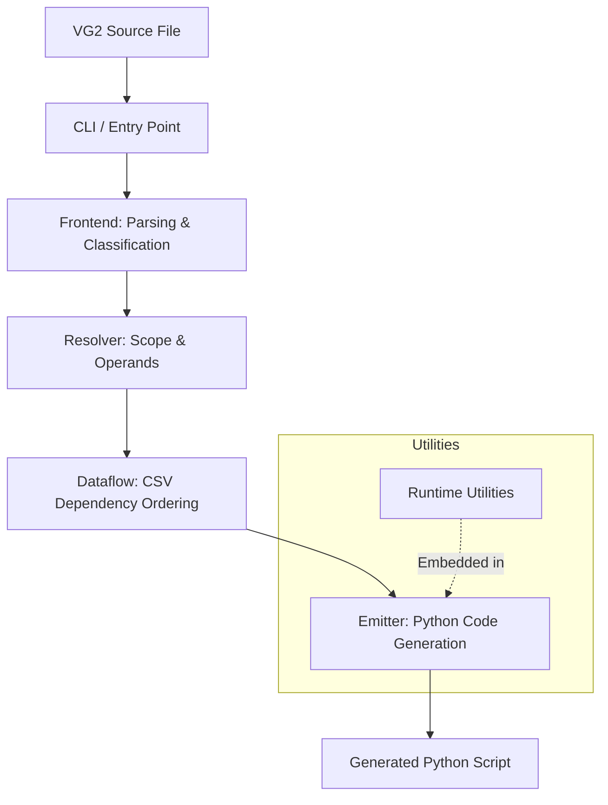

# vg2c

`vg2c` compiles legacy VG2 `.txt` pipeline scripts into executable Python (`.py`) scripts.

---

## Architecture Overview



## Requirements

* Python 3.11, 3.12, or 3.13
* Git
* [`uv`](https://docs.astral.sh/uv/)
* Access to the Intel internal Git network

## Installation

Clone the repository and open PowerShell in the project directory.

Allow Git to access the required Intel internal repositories directly:

```powershell
$env:no_proxy = "mfg-github.mfg.intel.com,tmg-repo.mfg.intel.com"
```

Install `vg2c` and its dependencies into the project virtual environment:

```powershell
uv sync
```

Verify the installation:

```powershell
uv run vg2c --help
```

## CLI Usage

Run the interactive CLI from the project root:

```powershell
uv run vg2c .
```

Specify separate input and output directories:

```powershell
uv run vg2c path\to\inputs path\to\outputs
```

Build a standalone executable with PyInstaller:

```powershell
uv run vg2c --build
```

When the virtual environment is already activated, `uv run` may be omitted:

```powershell
vg2c .
vg2c path\to\inputs path\to\outputs
vg2c --build
```
