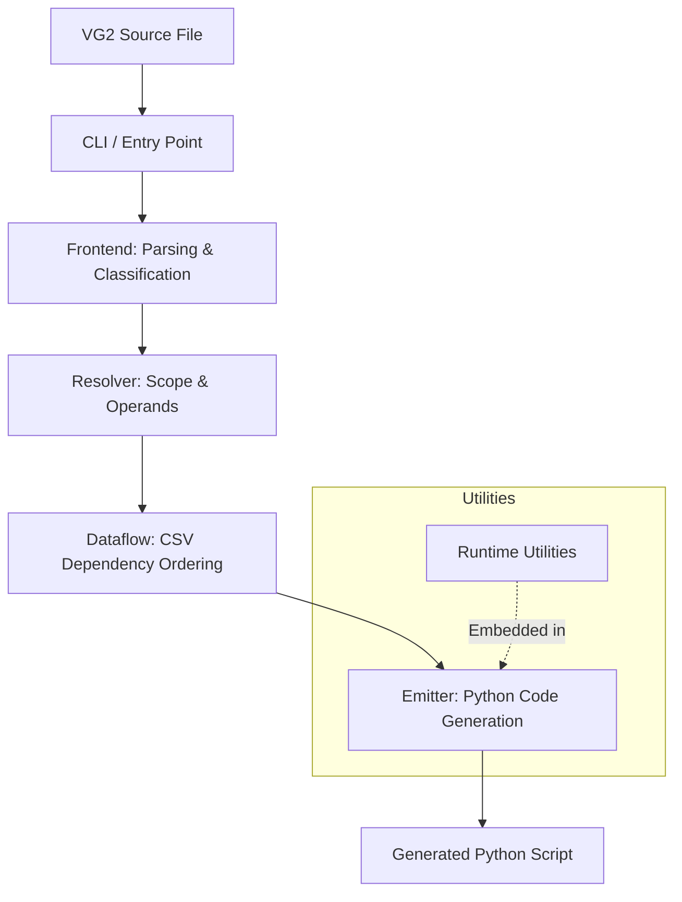

# vg2c

`vg2c` compiles legacy VG2 `.txt` pipeline scripts into executable Python (`.py`) scripts.

---

## Architecture Overview



## Requirements

* Python 3.11, 3.12, or 3.13
* Git
* [`uv`](https://docs.astral.sh/uv/)
* Access to the Intel internal Git network

## Installation

Clone the repository and open PowerShell in the project directory.

Allow Git to access the required Intel internal repositories directly:

```powershell
$env:no_proxy = "mfg-github.mfg.intel.com,tmg-repo.mfg.intel.com"
```

Install `vg2c` and its dependencies into the project virtual environment:

```powershell
py -m uv sync
```

Verify the installation:

```powershell
uv run vg2c --help
```

## Oracle Instant Client (optional DataSyncX setup)

Use this only when generated workflows need DataSyncX to query Oracle and a
full Oracle Client is not the selected client. Download the **Basic** package
for **Microsoft Windows (x64)** from Oracle's [Instant Client download page](https://www.oracle.com/database/technologies/instant-client/downloads.html).
Unzip its inner `instantclient_*` folder to a stable location, for example:

```text
C:\Oracle\instantclient_23_26\oci.dll
```

Do not use the Downloads directory as the runtime location. The Basic package
is sufficient for Python/DataSyncX; SQL*Plus and SDK packages are optional.
Ask the database team for the required Oracle Net files (`tnsnames.ora` and,
when needed, `sqlnet.ora`) and store them separately, for example in
`C:\Oracle\network\admin`.

For one PowerShell session, opt a generated workflow into Instant Client:

```powershell
$env:DATASYNCX_ORACLE_CLIENT = 'instant'
$env:DATASYNCX_INSTANT_CLIENT_DIR = 'C:\Oracle\instantclient_23_26'
$env:DATASYNCX_ORACLE_NET_CONFIG_DIR = 'C:\Oracle\network\admin'
Test-Path "$env:DATASYNCX_INSTANT_CLIENT_DIR\oci.dll"
```

Do not set `ORACLE_HOME` or change the machine-wide `PATH` for this setup.
These variables affect only the current PowerShell session; remove them (or
set `DATASYNCX_ORACLE_CLIENT` to `home`) and start a new Python process to use
the existing full-client configuration again. After the first Oracle read, the
terminal reports the loaded client and source. See
[the detailed Oracle client guide](docs/oracle_instant_client.md) for platform
limitations and troubleshooting.

## CLI Usage

Run the interactive CLI from the project root:

```powershell
uv run vg2c .
```

Specify separate input and output directories:

```powershell
uv run vg2c path\to\inputs path\to\outputs
```

Build a standalone executable with PyInstaller:

```powershell
uv run vg2c --build
```

When the virtual environment is already activated, `uv run` may be omitted:

```powershell
vg2c .
vg2c path\to\inputs path\to\outputs
vg2c --build
```

### Visual editor (Stages 1–7)

Install the optional local-app dependencies and frontend packages:

```powershell
python -m pip install -e ".[ui]"
Set-Location src/vg2c_ui/frontend
npm install
```

For development, run the API and Vite in separate terminals from the repository root:

```powershell
vg2c-ui .
npm --prefix src/vg2c_ui/frontend run dev
```

For a single local server, build the frontend once, then start `vg2c-ui`:

```powershell
npm --prefix src/vg2c_ui/frontend run build
vg2c-ui .
```

The server only accepts source/output paths within the workspace passed to `vg2c-ui`.
The production frontend is included in the Python package, so Node is only needed
when changing the React source. Utility names, parameters, annotations, defaults,
return types, and documentation come from the compiler utility registry. Unknown
utilities use a generic read-only card.

Edits follow an explicit preview/apply flow with undo/redo, full-Python validation,
revision conflict checks, and atomic writes. CSV previews are workspace-confined and
bounded. The `/api/commands` endpoints expose the same constrained operation model
to automation; they do not accept arbitrary replacement Python.

Use **Translate** to regenerate Python from VG2. Use **Open** to reopen an existing
generated workflow and retain previously applied visual-editor values.
