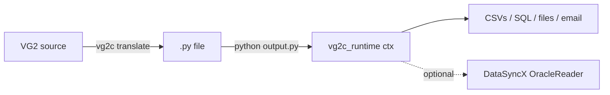

# Stage 7 Plan — Runtime + CLI (final stage)

## Scope

This is the **final stage**. After Stage 7 the pipeline goes from VG2 source → translated `.py` (Stages 5/6) → executable against a real or mocked runtime (Stage 7), invoked via a CLI. No further pipeline stages planned.

- Implement `src/vg2c_runtime/` — replace the `NotImplementedError` stubs Stage 5 declared and Stage 6 emitted calls against.
- Implement `src/vg2c/cli.py` — single subcommand `vg2c translate <input> -o <output> [--strict]`.
- Add one end-to-end runtime test that actually `exec`s the emitter's output against a mocked Reader.
- Update `pyproject.toml` for the script entry point.

## Stage 6.1 cleanup (prerequisite, do first)

Three small remaining issues from Stage 6's `actual_script.txt` output. Each is a localized patch (a few dozen lines combined). They don't block Stage 7 architecturally, but should be the first commits of Stage 7's branch so the e2e test runs against a clean emitter.

| # | Patch | Where |
|---|---|---|
| **R2** | Email argv: revert to original plan — emit `# TODO` + info diagnostic instead of guessed positional binding (`to=''`, `subject='self'`, `body='"Critical:'` is wrong). Wait for a real `SQLPathFinder_Email.va` fixture to pin positions. | `src/vg2c/emitter/handlers.py` UTILITY dispatch |
| **R3** | SPF-DELETE / ROBOCOPY argv: the path-list arg comes through as a single comma-joined string (`'a.csv,b.csv,c.csv'`) and the trailing `'N'`/`'Y'` is a recurse flag, not a path or a `dst` value. Comma-split the path-list slot; pull the flag into its own kwarg; don't shove it into `dst`. | `src/vg2c/emitter/handlers.py` UTILITY argv parser |
| **R7** | Walker emits `with ctx.macro_scope("ctime.csv", row_iter=True):` for every `{START-MACRO}` block. Static-vars blocks (no `/CSV=` option on the START-MACRO line) should be `row_iter=False`. Check the StartMacro payload from Stage 2; if it lacks a distinguishing field, derive from presence/absence of CSV binding. | `src/vg2c/emitter/walker.py` `_emit_start_macro` |

## Architecture



The translator and runtime are **separate processes**. The generated `.py` is a standalone artefact — distribute it on its own. Consumers need `vg2c_runtime` + (optionally) DataSyncX at run-time; they do NOT need `vg2c` itself.

## Runtime modules — `src/vg2c_runtime/`

Each is one small file with one tested helper class. Replace existing `NotImplementedError` stub bodies in-place.

### `macro.py`
- `MacroState`: stack of frames, top-down named lookup, case-insensitive on lookup (uppercased on store).
- Public API matches what the emitter already calls:
  - `named(name) -> str` — walks stack top-down.
  - `set_named(name, value)` — writes to top frame.
  - `positional(index)` / `set_positional(index, value)` — top frame's argv list.
- `macro_scope(csv_path, row_iter)` contextmanager pushes/pops a frame.
  - `row_iter=True`: binds each row's columns as named vars; the body re-enters per row.
  - `row_iter=False`: static-vars frame, body runs once.

### `csv_io.py`
- `CsvIO` over stdlib `csv` (no pandas dep for v1).
  - `iter(name) -> Iterator[dict[str, str]]`
  - `read(name) -> Path` (resolved against cwd)
  - `write(name, rows, header=None)` — UTF-8, no BOM, `newline=""`, auto-mkdir parents.
  - `row_count(name) -> int` (data rows only, header excluded)

### `sqlite_engine.py`
- `SqliteEngine.run_join(sql, inputs, output)`:
  1. Open in-memory `sqlite3` connection.
  2. For each input CSV, load as a table named after the filename stem (strip both `.tab` and `.csv`).
  3. Split SQL on `;` (respecting quoted strings); execute non-SELECT statements via `cursor.execute`.
  4. Run the final SELECT, write rows to `output` CSV.
- **Pitfall**: do NOT use `executescript()` — it doesn't return rows.

### `sql_macros.py`
- `sql_get_csv_list(path, column_ref, lead_in) -> str`:
  - `column_ref` is int → 1-based column index. `column_ref` is str → column-name lookup.
  - Read CSV, extract column values, deduplicate (preserve order).
  - Chunk into `IN ('v1',…,'v1000') {lead_in} IN ('v1001',…)` blocks of ≤1000 values (Oracle hard limit).
  - Each value is single-quoted with embedded `'` doubled.
  - Returns the chunked clause as a string; the caller's surrounding SQL supplies the leading `IN (` and trailing `)`.

### `fs_ops.py`
- `FileSystemOps.copy(src, dst, recurse=False)` — pathlib + shutil. Recurse for directories.
- `FileSystemOps.rename(src, dst)` — `Path.rename`.
- `FileSystemOps.delete(paths, recurse=False)` — accepts list. Files via `unlink(missing_ok=True)`; dirs via `shutil.rmtree` when `recurse`.

### `mail.py`
- `MailService.send(to, subject, body, attachments=None, from_addr=None)`:
  - Stdlib `smtplib.SMTP` + `email.message.EmailMessage`.
  - Config from env: `VG2C_SMTP_HOST`, `VG2C_SMTP_PORT` (default 25), `VG2C_FROM_ADDRESS`.
  - Raises a clear `RuntimeError` when host is not configured.

### `external.py`
- `ExternalProcess.run(argv, cwd=None, env=None, check=False) -> int`:
  - `subprocess.run(argv, …)`, returns exit code.
  - No default timeout (VG2 scripts legitimately run for minutes).

### `readers.py`
- `Reader` ABC declaring `read(sql: str) -> list[dict]`.
- `MockReader(canned: dict[str, list[dict]])` — used by tests; matches SQL to canned results by literal key for now.
- `OracleReader(database: str)`:
  - Lazy-imports `datasyncx` inside `__init__`. Raises a clear `RuntimeError` with install instructions if import fails.
  - `read(sql)`:
    1. Substitute `<<<NAME>>>` from active `MacroState` (the `PipelineContext.macro` singleton).
    2. Delegate to DataSyncX's reader API for the given `database` ("MARS" | "OASYS" | "ARIES").
    3. Return rows as `list[dict]`.
- Factory functions: `reader_mars()`, `reader_oasys()`, `reader_aries()` — what Stage 5 emits in `ctx.reader_mars()` etc.

### `write_file.py`
- `write_file(path, template, vars=None)`:
  - If `vars is None`: substitute `<<<NAME>>>` from active `MacroState` at call time (no caching — row-iter scopes need fresh substitution each call).
  - Else: substitute from supplied dict.
  - Write UTF-8, auto-mkdir parents.

### `context.py`
- `PipelineContext` singleton exposing:
  - `ctx.macro` (`MacroState`)
  - `ctx.csv_io` (`CsvIO`)
  - `ctx.sqlite` (`SqliteEngine`)
  - `ctx.sql_macros` (`SqlMacros`)
  - `ctx.fs` (`FileSystemOps`)
  - `ctx.mail` (`MailService`)
  - `ctx.external` (`ExternalProcess`)
  - `ctx.write_file(...)` (free function delegating to `write_file.py`)
  - `ctx.reader_mars()` / `ctx.reader_oasys()` / `ctx.reader_aries()` factories
  - `ctx.macro_scope(...)` contextmanager (delegates to `MacroState`)
  - `ctx.eval_condition(...)` (if Stage 5 emitter still calls it — check current emitter output before keeping)
- Import path must match what Stage 5 emits today: verify `from vg2c_runtime import ctx` works.

## CLI — `src/vg2c/cli.py`

- stdlib `argparse`.
- Single subcommand: `vg2c translate <input.vg2> [-o output.py] [--strict] [--oasys-schema SCHEMA]`.
- Runs `parse → classify → resolve → analyze → dispatch → emit`.
- Writes `.py` to `-o` (or stdout when omitted).
- Diagnostic formatter: `<severity> [<code>] <file>:<line>:<col>: <message>`, sorted by severity then source order, one per line, to stderr.
- `--strict`: exit code 1 if any diagnostic has severity `"error"`.
- `pyproject.toml`:
  ```toml
  [project.scripts]
  vg2c = "vg2c.cli:main"
  ```

## Pitfalls

### High
- **H1. DataSyncX availability.** `import datasyncx` may fail in CI. Lazy-import inside `OracleReader.__init__`. Tests use `MockReader` exclusively. CI must pass without DataSyncX installed.
- **H2. SQLite multi-statement.** Sample SQL has `DROP INDEX; CREATE INDEX; SELECT;`. `executescript()` doesn't return rows. Split-then-execute pattern.
- **H3. SQL_Get_CSV_List chunking semantics.** Oracle IN-list limit is 1000. Output is `IN (v1..v1000) {lead_in} IN (v1001..)`. Document precisely; test with a 1001-row fixture.
- **H4. Macro substitution scope.** `Reader.read(sql)` and `write_file(template)` substitute from the *current* `MacroState`, not a captured value. Implementation: read `PipelineContext.macro` at call time.

### Medium
- **M1. 1-based column index** in VG2 `SQL_Get_CSV_List`. Off-by-one silently produces wrong queries.
- **M2. CSV encoding.** UTF-8 explicit on write; tolerant on read (`errors="replace"` fallback).
- **M3. Path resolution.** All paths relative to `Path.cwd()`, not `__file__`. The generated `.py` runs from a working directory containing input CSVs.
- **M4. `write_file(vars=None)` must not cache** — re-substitute each call so row-iter scopes write different files per iteration.
- **M5. Email env config** — fail clearly with install/setup instructions when host not set.

### Low
- **L1.** No default subprocess timeout. VG2 scripts run for minutes.
- **L2.** `MacroState` not thread-safe (single-threaded runtime).
- **L3.** Auto-mkdir for output dirs in `write_file` and `csv_io.write`.

## Testing strategy

### Unit tests — `tests/runtime/test_*.py`
One file per helper module:

| File | Coverage |
|---|---|
| `test_macro_state.py` | push/pop, top-down lookup, case-insensitive, `set_named` writes to top frame |
| `test_csv_io.py` | round-trip read/write, `row_count` excludes header, `iter` yields dicts |
| `test_sqlite_engine.py` | multi-statement (DROP/CREATE/SELECT), CSV load as table, output CSV correct |
| `test_sql_macros.py` | 1-based int column, named column, >1000-row chunking, `lead_in` placement |
| `test_fs_ops.py` | copy / rename / delete via `tmp_path` |
| `test_external.py` | trivial command exits 0 |
| `test_write_file.py` | substitution from active scope, bypass with `vars=`, UTF-8 |
| `test_readers.py` | `MockReader` canned data, `<<<NAME>>>` substituted before delegate, DataSyncX import deferred |
| `test_mail.py` | construction only — no live SMTP |

### E2E runtime test — `tests/runtime/test_e2e_short.py`
- Run full pipeline on `tests/fixtures/script_short.txt` → produce `.py` source string.
- `exec(source, {})` with `vg2c_runtime.ctx` patched to use `MockReader` and a `tmp_path`-rooted `CsvIO`.
- Assert expected output CSVs exist with expected row counts.
- **This is the "the generated code actually runs" proof. If this passes, Stage 7 is functionally complete.**

### CLI tests — `tests/cli/test_translate.py`
- Happy path: `vg2c translate tests/fixtures/script_short.txt -o tmp.py` exits 0, writes file.
- `--strict`: deliberately malformed fixture → exit 1.
- Diagnostic formatter output matches stable shape.

### Cross-stage regression
- Re-run existing Stage 1–6 tests; no breakage.

### Not in scope
- Live Oracle execution (DataSyncX optional).
- Live SMTP delivery.
- Performance benchmarks.
- Doc site / API doc generation.

## Non-goals

- No new pipeline stage after this.
- No agentic AI.
- No GUI.
- No second CLI subcommand beyond `translate` (no `lint`, no `format`).
- No re-architecture of Stages 1–6.
- No DataSyncX hard dependency — soft via `try: import datasyncx except ImportError`.
- No multi-target runtime guarantee (Linux + Windows path normalisation is fine; macOS untested).
- No optional formatter pass — run `ruff format` externally if desired.
- No view expansion.

## Simplicity check

### Intentionally NOT added
- Plugin / extension mechanism for runtime helpers — direct module imports are enough.
- Typed config schema (Pydantic / dataclasses-json) — env vars + CLI flags suffice.
- Logging framework — single-process, `print` to stderr is fine.
- Test-runner wrapper — pytest direct.
- `vg2c lint` mode — `vg2c translate` already emits diagnostics; `--strict` is the lint gate.
- Distribution packaging for generated scripts — they're `.py` files, distribute as such.

### Where future complexity may grow
- **DataSyncX API drift** — shielded behind `OracleReader` adapter so the rest of runtime is insulated.
- **SQLite ↔ Oracle dialect drift** — if real `actual_script.txt` SQL produces different results between dialects, isolate dialect-specific transforms in `sqlite_engine.py`.
- **Macro scope edge cases** — macros that reassign their own vars mid-iteration. Handle when a real fixture forces the issue.
- **Email shape parsing** — once a real `SQLPathFinder_Email.va` fixture is captured, the utility-shape matcher can do R2 properly with structured argv binding.

## Decisions

- **D1.** DataSyncX is a soft dependency. CI runs against `MockReader` only.
- **D2.** Stdlib `csv` over pandas — keep deps minimal; no DataFrame value-add at this scale.
- **D3.** In-memory SQLite for SQL joins. Avoids DB setup.
- **D4.** Email via stdlib smtplib. No need for `aiosmtpd` / `yagmail`.
- **D5.** Single CLI subcommand (`translate`). No premature multi-command structure.
- **D6.** Diagnostics to stderr; emitted source to stdout (or `-o` file). Clean pipe semantics.
- **D7.** `MacroState` is a stack of dict-like frames. Top-down lookup. Case-insensitive (VG2 macros are case-insensitive).
- **D8.** `SQL_Get_CSV_List` chunking at 1000. Oracle hard limit; conservative is fine.

## Commit path

1. **Stage 6.1 cleanup** — R2 (email TODO), R3 (delete/copy argv split), R7 (walker row_iter detection).
2. **Runtime helpers** in order of size — `macro.py` → `fs_ops.py` → `external.py` → `csv_io.py` → `sql_macros.py` → `write_file.py` → `sqlite_engine.py` → `readers.py` → `mail.py`. Each with its unit test. Each commit independently green.
3. **`context.py`** — wire the helpers into the singleton; ensure `from vg2c_runtime import ctx` works exactly as Stage 5 emits.
4. **`tests/runtime/test_e2e_short.py`** — first end-to-end proof. If this passes, the project's core deliverable works.
5. **`cli.py`** + `pyproject.toml` `[project.scripts]` entry.
6. **`tests/cli/`** — translate happy path + `--strict` failure.
7. **README update** — minimal: install, `vg2c translate`, run the output. Note DataSyncX as soft dependency for live Oracle access.
8. Full suite green; ship.

Each step is locally testable. If the project needs to pause at any point, all earlier work still has value (the emitter alone is already useful for code review).

## Further considerations

- After Stage 7 ships, when consumers run real translated scripts and hit issues, the diagnostic pattern from Stage 6 (named codes + locations) makes the bugs cheap to triage. Keep the diagnostic discipline in runtime errors too: when `Reader.read` fails or `SqliteEngine.run_join` errors, the message should include the macro-scope state at failure time so the user can map back to the VG2 source.
- The `MockReader` design will probably grow a "match SQL by regex" mode for tests that want to exercise dynamic queries. Add it when the first test needs it, not before.
- If/when DataSyncX gets a stable Python API, consider promoting it from soft to required dep — but only when the user community is ready, not earlier.
